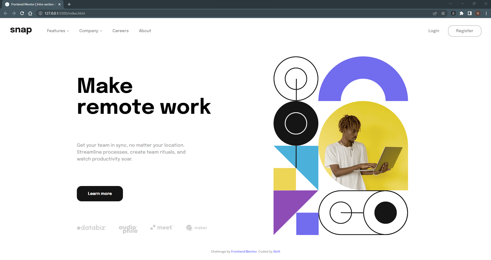
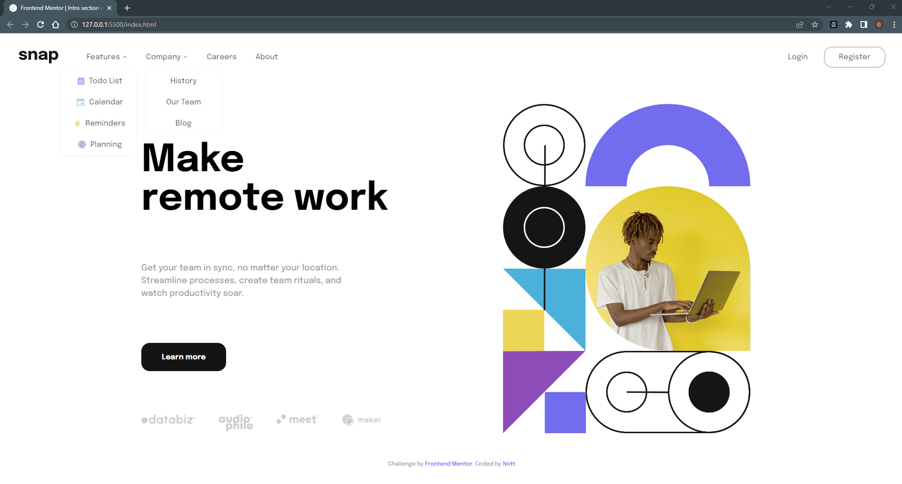
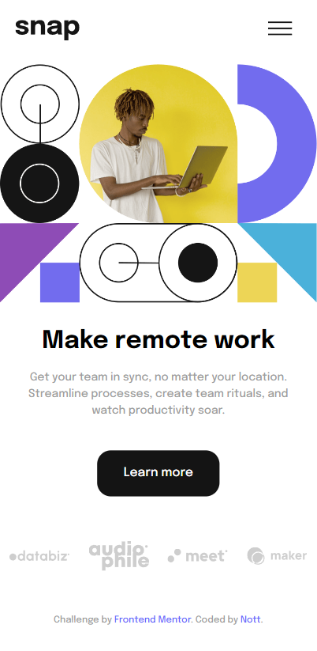
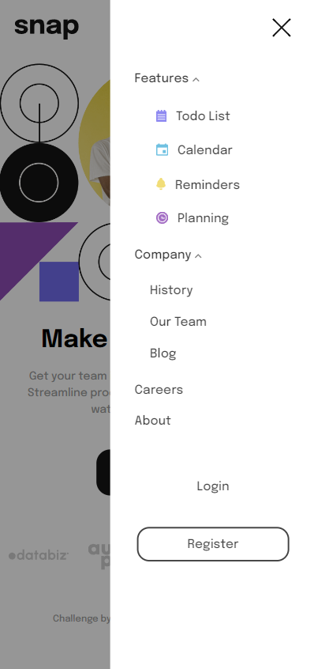

# Frontend Mentor - MY FIRST FORKED PROJECT

This is a solution to the [Intro section with dropdown navigation challenge on Frontend Mentor](https://www.frontendmentor.io/challenges/intro-section-with-dropdown-navigation-ryaPetHE5). Frontend Mentor challenges help you improve your coding skills by building realistic projects. 

### The challenge

Users should be able to:

- View the relevant dropdown menus on desktop and mobile when interacting with the navigation links
- View the optimal layout for the content depending on their device's screen size
- See hover states for all interactive elements on the page

### Screenshot

- Desktop Design:

- Desktop Design with Dropdown:

- Mobile Design:

- Mobile Design with menu collapsed:

- Mobile Design with menu expanded:

### Links

- Challenge URL: [Challenge](https://www.frontendmentor.io/challenges/intro-section-with-dropdown-navigation-ryaPetHE5/hub/intro-section-with-dropdown-navigation-4mluecyKXv)
- Live Site URL: [Site](https://intro-section-with-dropdownnavigation.netlify.app/)

### Built with

- HTML5 
- CSS
- JavaScript

## Author
- Frontend Mentor - [@nott7](https://www.frontendmentor.io/profile/nott7)
- Twitter - [@gabrynott](https://www.twitter.com/gabrynott)
- LinkedIn - [Gabriele Notonica](https://www.linkedin.com/in/gabriele-notonica-a28080253/)

